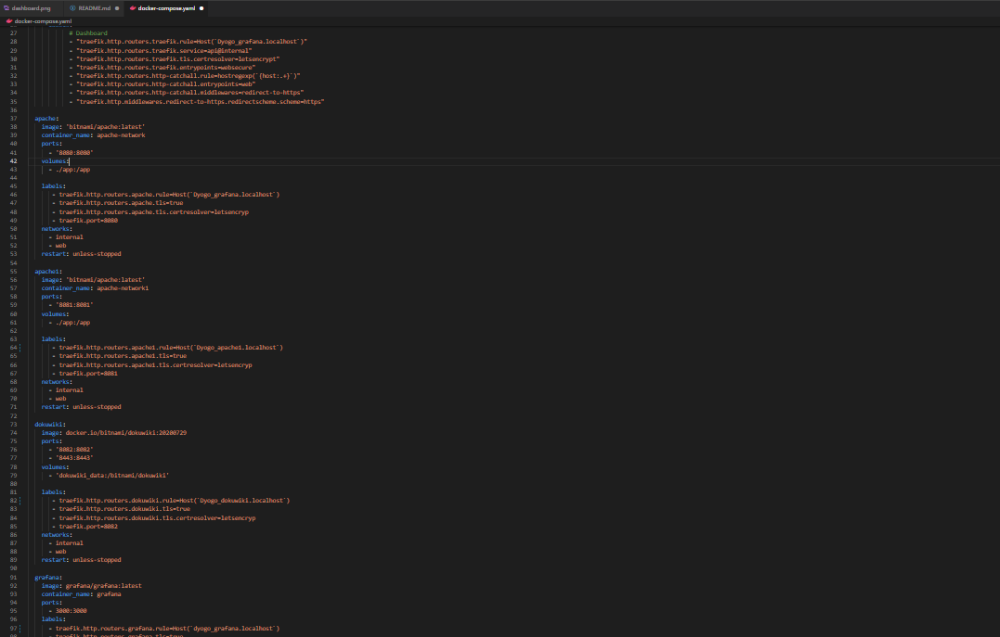
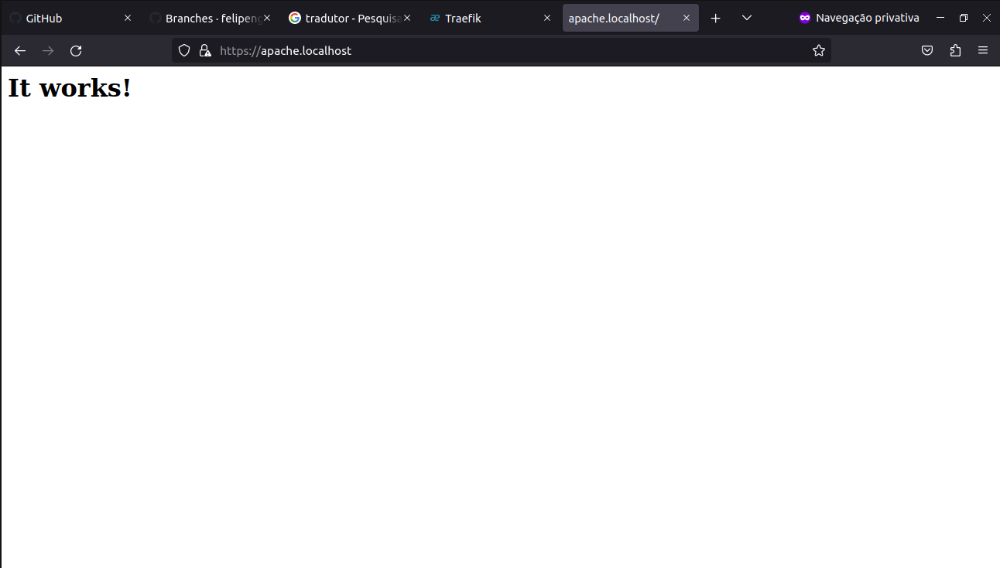
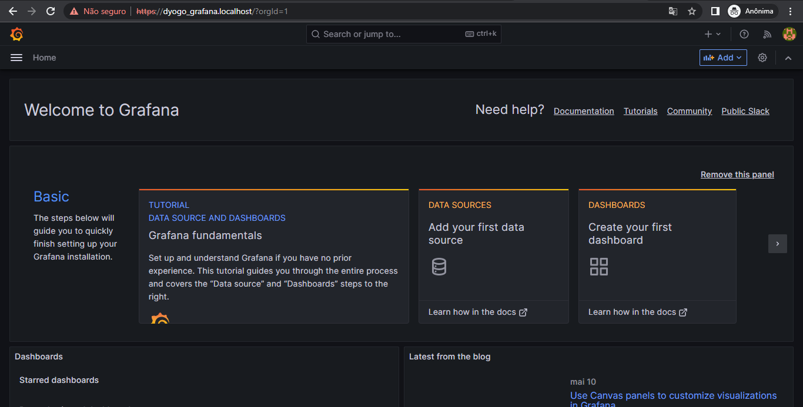
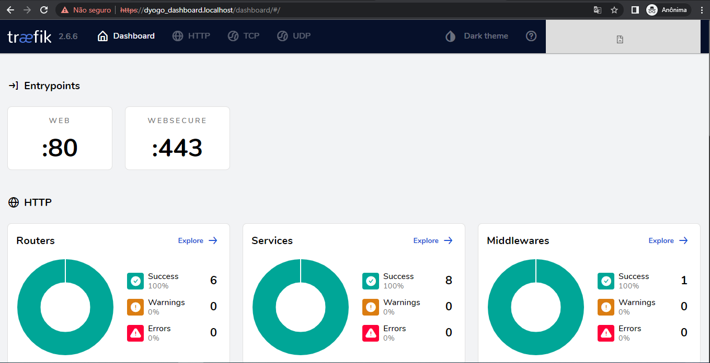
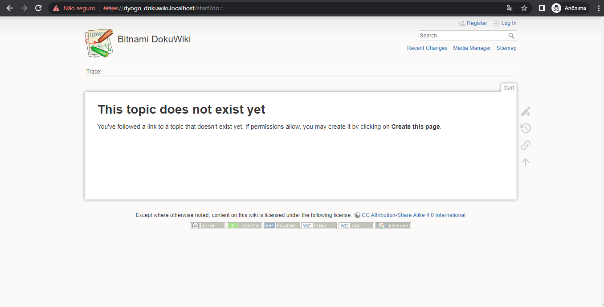
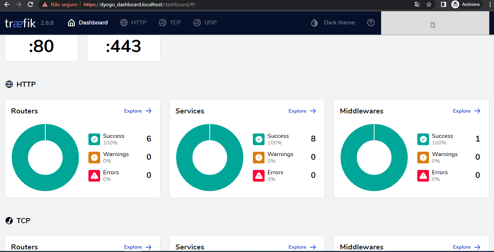

## 1° Passo:
Abrir o docker-compose.yaml como ediçao de texto e alterar dentro da tag "LABEL" os subdominios onde fazem referência ao HOST: 




## 2° Passo:
Abrir o terminal e inserir o comando para iniciar os serviços:

$ docker-compose up --build

Caso necessite ou queira parar o serviço:

$ docker-compose stop

Caso necessite ou queira remover o serviço:

$ docker-compose rm


## 3° Passo:
Utilize o navegador web e digite as seguintes urlscom os subdominios que foram alterados:









E verificando dentro do Routers do Traefikk, podemos ver nosso subdominio:


## Resolvendo vulnerabilidade
Enfrentei um problema de segurança no meu sistema de proxy reverso, onde havia uma vulnerabilidade que permitia a entrada de qualquer pessoa externa. Para solucionar isso, optamos por isolar os serviços em uma rede segregada e desativar as portas expostas na máquina. Foi necessário remover todas as tags "ports", exceto a do traefik. Ademais, nas tags "network", desativei a que se referia a "web".

```yaml
version: '3'
services:

  traefik:
      image: "traefik:v2.6.6"
      container_name: "traefik-network"
      command:
      - --entrypoints.web.address=:80
      - --entrypoints.websecure.address=:443
      - --providers.docker
      - --api
      - --log.level=DEBUG
      - --certificatesresolvers.letsencrypt.acme.email=felipeng.eletrica@gmail.com
      - --certificatesresolvers.letsencrypt.acme.storage=/acme.json
      - --certificatesresolvers.letsencrypt.acme.tlschallenge=true
      ports:
        - "80:80"
        - "443:443"
      networks:
        - internal
        - web

      volumes:
            - "/var/run/docker.sock:/var/run/docker.sock:ro"
            - "./acme.json:/acme.json"
      labels:
            # Dashboard
            - "traefik.http.routers.traefik.rule=Host(`Dyogo_dashboard.localhost`)"
            - "traefik.http.routers.traefik.service=api@internal"
            - "traefik.http.routers.traefik.tls.certresolver=letsencrypt"
            - "traefik.http.routers.traefik.entrypoints=websecure"
            - "traefik.http.routers.http-catchall.rule=hostregexp(`{host:.+}`)"
            - "traefik.http.routers.http-catchall.entrypoints=web"
            - "traefik.http.routers.http-catchall.middlewares=redirect-to-https"
            - "traefik.http.middlewares.redirect-to-https.redirectscheme.scheme=https"

  apache:
    image: 'bitnami/apache:latest'
    container_name: apache-network
    ##ports:
      ##- '8080:8080'
    volumes:
      - ./app:/app
    
    labels:
       - traefik.http.routers.apache.rule=Host(`Dyogo_apache.localhost`)
       - traefik.http.routers.apache.tls=true
       - traefik.http.routers.apache.tls.certresolver=letsencryp
       - traefik.port=8080
    networks:
      - internal
      ##- web
    restart: unless-stopped

  apache1:
    image: 'bitnami/apache:latest'
    container_name: apache-network1
    ##ports:
      ##- '8081:8081'
    volumes:
      - ./app:/app
    
    labels:
       - traefik.http.routers.apache1.rule=Host(`Dyogo_apache1.localhost`)
       - traefik.http.routers.apache1.tls=true
       - traefik.http.routers.apache1.tls.certresolver=letsencryp
       - traefik.port=8081
    networks:
      - internal
      ##- web
    restart: unless-stopped

  dokuwiki:
    image: docker.io/bitnami/dokuwiki:20200729
    ##ports:
     ## - '8082:8082'
      ##- '8443:8443'
    volumes:
      - 'dokuwiki_data:/bitnami/dokuwiki'

    labels:
       - traefik.http.routers.dokuwiki.rule=Host(`Dyogo_dokuwiki.localhost`)
       - traefik.http.routers.dokuwiki.tls=true
       - traefik.http.routers.dokuwiki.tls.certresolver=letsencryp
       - traefik.port=8082
    networks:
      - internal
      ##- web
    restart: unless-stopped

  grafana:
    image: grafana/grafana:latest
    container_name: grafana
    ##ports:
      ##- 3000:3000
    labels:
      - traefik.http.routers.grafana.rule=Host(`Dyogo_grafana.localhost`)
      - traefik.http.routers.grafana.tls=true
      - traefik.http.routers.grafana.tls.certresolver=letsencrypt
      - traefik.port=3000

    networks:
      - internal
      ##- web

    environment: 
      - GF_SERVER_HTTP_PORT=3000
    restart: unless-stopped

volumes:
  grafana_data:
  dokuwiki_data:

networks:
  web:
    external: true
  internal:
    external: false
```