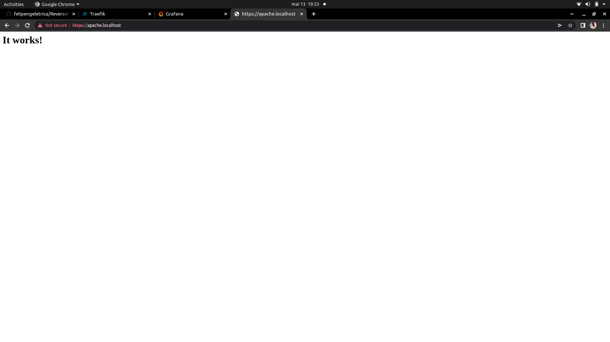

# Projeto PROXY reverso  (DIDÁTICO PARA O USO NAS AULAS DE REDES DE COMPUTADORES)

 Utililiza o Traefik para servidor Apache, Grafana e monitoramento utilizando o dashboard próprio do Traefik.
    
Este projeto utiliza Docker facilitando a implantação (deploy) dos serviços. 
 ***

 ## Implantação dos serviços
 Abrir o terminal e execute os seguintes comandos:

Construindo e excutando os serviços (pressione ctrl+c para cencelar):

 > $ docker-compose up --build

 Utilize -d para dar um "detach" rodar o serviço na máquina

> $ docker-compose up --build -d

Parando serviços: 
> $ docker-compose stop

Removendo serviços: 
> $ docker-compose rm
***

 ## Testando os serviços

Utilize o navegador web e digite a seguinte url:

> http://apache.localhost

  

 > http://grafana.localhost

  

  > http://dashboard.localhost

  

  > http://dashboard.localhost

  

***
 ## Resolvendo vulnerabilidade

 Estava com um problema no proxy reverso onde havia uma brecha de segurança no meu sistema que deixava qualquer um entrar pelo lado de fora, então isolamos os serviços em uma rede segregada e removemos as portas que estavam expostas na máquina. Para resolver isso foram chegadas todas as tags "ports", exceto do traefik. Além disso, nas tags "network" comentei onde dizia "web".

```yaml
 version: '3'
services:

  traefik:
      image: "traefik:v2.6.6"
      container_name: "traefik-network"
      command:
      - --entrypoints.web.address=:80
      - --entrypoints.websecure.address=:443
      - --providers.docker
      - --api
      - --log.level=DEBUG
      - --certificatesresolvers.letsencrypt.acme.email=felipeng.eletrica@gmail.com
      - --certificatesresolvers.letsencrypt.acme.storage=/acme.json
      - --certificatesresolvers.letsencrypt.acme.tlschallenge=true
      ports:
        - "80:80"
        - "443:443"
      networks:
        - internal
        - web

      volumes:
            - "/var/run/docker.sock:/var/run/docker.sock:ro"
            - "./acme.json:/acme.json"
      labels:
            # Dashboard
            - "traefik.http.routers.traefik.rule=Host(`dashboard.localhost`)"
            - "traefik.http.routers.traefik.service=api@internal"
            - "traefik.http.routers.traefik.tls.certresolver=letsencrypt"
            - "traefik.http.routers.traefik.entrypoints=websecure"
            - "traefik.http.routers.http-catchall.rule=hostregexp(`{host:.+}`)"
            - "traefik.http.routers.http-catchall.entrypoints=web"
            - "traefik.http.routers.http-catchall.middlewares=redirect-to-https"
            - "traefik.http.middlewares.redirect-to-https.redirectscheme.scheme=https"

  apache:
    image: 'bitnami/apache:latest'
    container_name: apache-network
    ##ports:
    ##  - '8080:8080'
    volumes:
      - ./app:/app
    
    labels:
       - traefik.http.routers.apache.rule=Host(`cailan_apache.localhost`)
       - traefik.http.routers.apache.tls=true
       - traefik.http.routers.apache.tls.certresolver=letsencryp
       - traefik.port=8080
    networks:
      - internal
  ##  - web
    restart: unless-stopped

  apache1:
    image: 'bitnami/apache:latest'
    container_name: apache-network1
    ##ports:
    ## - '8081:8081'
    volumes:
      - ./app:/app
    
    labels:
       - traefik.http.routers.apache1.rule=Host(`cailan_apache1.localhost`)
       - traefik.http.routers.apache1.tls=true
       - traefik.http.routers.apache1.tls.certresolver=letsencryp
       - traefik.port=8081
    networks:
      - internal
  ##  - web
    restart: unless-stopped

  dokuwiki:
    image: docker.io/bitnami/dokuwiki:20200729
    ##ports:
    ##  - '8082:8082'
    ##  - '8443:8443'
    volumes:
      - 'dokuwiki_data:/bitnami/dokuwiki'

    labels:
       - traefik.http.routers.dokuwiki.rule=Host(`cailan_dokuwiki.localhost`)
       - traefik.http.routers.dokuwiki.tls=true
       - traefik.http.routers.dokuwiki.tls.certresolver=letsencryp
       - traefik.port=8082
    networks:
      - internal
   ## - web
    restart: unless-stopped

  grafana:
    image: grafana/grafana:latest
    container_name: grafana
    ##ports:
    ##  - 3000:3000
    labels:
      - traefik.http.routers.grafana.rule=Host(`cailan_grafana.localhost`)
      - traefik.http.routers.grafana.tls=true
      - traefik.http.routers.grafana.tls.certresolver=letsencrypt
      - traefik.port=3000

    networks:
      - internal
   ## - web

    environment: 
      - GF_SERVER_HTTP_PORT=3000
    restart: unless-stopped

volumes:
  grafana_data:
  dokuwiki_data:

networks:
  web:
    external: true
  internal:
    external: false
```