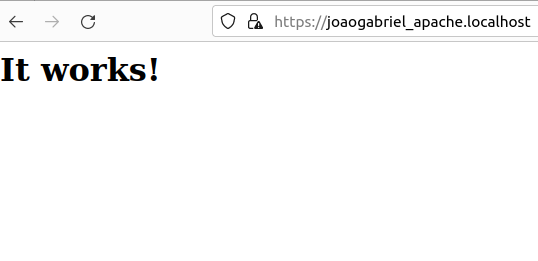
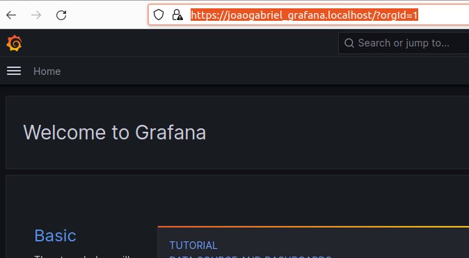
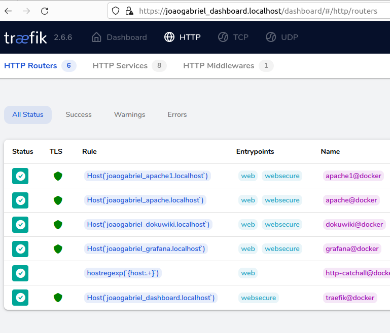
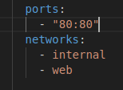

# Projeto PROXY reverso  (DIDÁTICO PARA O USO NAS AULAS DE REDES DE COMPUTADORES)
João Gabriel C.
#

 ## Implantação dos serviços
 Abrir o terminal e execute os seguintes comandos:

Construindo e excutando os serviços (pressione ctrl+c para cencelar):

 > $ docker-compose up --build

Caso o comando não funcione, tente remover o apache com o seguinte comando e depois tente movamente:

> $ apt remove apache2 

 Utilize -d para dar um "detach" rodar o serviço na máquina

> $ docker-compose up --build -d

Parando serviços: 
> $ docker-compose stop

Removendo serviços: 
> $ docker-compose rm
***

## Alterar o Subdominio

- Altere o nome do host no subdominio de LocalHost.

##

        Antes
> traefik.http.routers.apache.rule=Host(`apache.localhost`)

        Depois
> traefik.http.routers.apache.rule=Host(`joaogabriel_apache.localhost`)

# 

 ## Testando os serviços

Utilize o navegador web e digite a seguinte url:

> http://joaogabriel_apache.localhost

  

 > http://joaogabriel_grafana.localhost

  

  > http://joaogabriel_dashboard.localhost

 

 ## Remover Acesso IP

 Remover o acesso via IP obrigando o acesso através do domínio.
Apague as portas e tag web de todos os serviços, exceto traefik.

