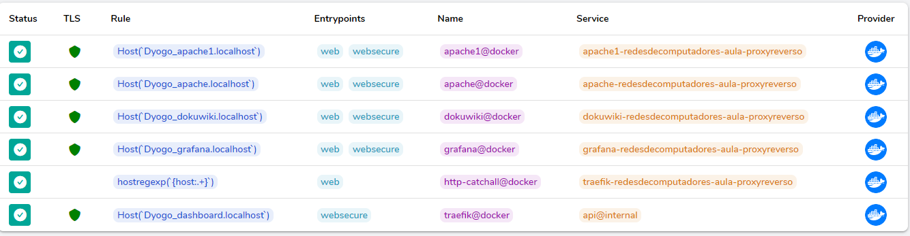

1° Passo:
Abrir o docker-compose.yaml como ediçao de texto e alterar dentro da tag "LABEL" os subdominios onde fazem referência ao HOST: 

2° Passo:
Abrir o terminal e inserir o comando para iniciar os serviços:

$ docker-compose up --build

Caso necessite ou queira parar o serviço:

$ docker-compose stop

Caso necessite ou queira remover o serviço:

$ docker-compose rm

3° Passo:
Utilize o navegador web e digite as seguintes urlscom os subdominios que foram alterados:

E verificando dentro do Routers do Traefikk, podemos ver nosso subdominio:

